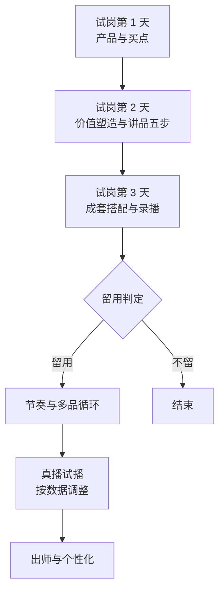

# 主播面试与培训 SOP

2026-09-22

## 核心原则

只筛三件事：能力达标、真的想做、扛得住前期。缺一件，不进培训。

- **能力达标**：看试播和六力打分，不看聊天时说得多好。
- **真的想做**：看过往每家待了多久、为什么走，再用一份回家作业验证。
- **扛得住前期**：面试时先把最差的情况讲清楚，留下来的人是自己选的。

两道门都过了才开始培训：

1. **门一「能不能来」**：面谈。听完最差情况和待遇框架，她仍然要来。
2. **门二「能不能干」**：15 分钟试播加六力打分，过线。

过了两道门，再用回家作业和书面确认锁定，才约试岗。

投入跟着承诺走：面试只给规则，试岗期给讲品结构和练习，确认留用后才给完整方法论和数据诊断。

流程跑起来之前，要先定三件事：待遇数字、试播费谁出、试岗结束谁拍板留不留。

## 面试流程总览

一个候选人从初筛到锁定，总共花你约 1 小时，每一步都可以当场结束。

| 步骤 | 时长 | 做什么 | 当场结束的条件 |
| --- | --- | --- | --- |
| 初筛（微信语音） | 5 分钟 | 时间能否稳定、是否愿意上镜、过往经历 | 时间不稳定，或不愿上镜 |
| 门一：面谈 | 20–30 分钟 | 履历、动机、丑话说前头、待遇框架 | 红灯 3 个及以上 |
| 门二：试播 | 15 分钟 | 陌生品试讲、挑刺打断、六力打分 | 任一一票否决项不过 |
| 回家作业 | 24 小时内 | 录一段 3 分钟讲品视频发来 | 没按时交，或明显敷衍 |
| 锁定 | 10 分钟 | 条件微信确认、收资料 | 不回复“确认”，或资料不齐 |
| 试岗 | 3 天 | 按培训流程带，每天结试播费 | 见培训流程的留用判定 |

面试前让候选人先看一场我们的直播，面谈时问她看到了什么。没看的，本身就是信号。

## 面试题库与讲解

面谈问 10 道题，听的是证据：具体经历、具体数字。只会说“没问题”的，一律追问。

### A. 履历与留存

过往时长是最准的留存预测，这组题最重要。

1. 这几年做过几家？每家待了多久？为什么走？
   - 听什么：平均每家多久；离职原因全是外因，还是有自己的判断。
   - 红灯：平均不到 6 个月，原因全是“公司不行”“老板不好”。
   - 绿灯：每次走的原因说得具体，里面有自己的判断。
2. 上一份做到什么结果？场均多少？最好的一场卖了多少？
   - 听什么：能不能直接报出数字。
   - 红灯：说不出数，或者前后对不上。
   - 绿灯：张口就有数，还能说出那场为什么好。
3. 现在还在看别的机会吗？跟我们比，你最在意哪一点？
   - 听什么：诚不诚实，以及她的选择标准。
   - 红灯：说没有，前面却提过在面别家。
   - 绿灯：坦白在看，说得出自己看重什么。

### B. 动机

4. 来之前看过我们的直播吗？看到了什么？
   - 红灯：没看，或者只说“挺好的”。
   - 绿灯：说得出某一款、某个讲法，还有自己的看法。
5. 为什么想做饰品？一年后想做到什么程度？
   - 听什么：她的目标和我们能给的对不对得上。
   - 红灯：只想快速拿高提成，或者“先干着看”。
   - 绿灯：想在一个品类里做深，目标里有具体的数。

### C. 预期与抗压

6. 丑话说前头。这一题你先说，然后看她反应：
   - 你说：“我们现在是起步期。前期流量不大，场观可能就几十几百人，提成前期不会多。前两周每天都要练、要录、要被我挑问题。能接受吗？”
   - 听什么：她接下来问什么。
   - 红灯：秒答“没问题”，之后什么都不问。
   - 绿灯：追问底薪、提成怎么算、多久能起量。认真算账的人才会留下。
7. 遇到过连着几场场观很低、不出单吗？当时怎么做的？
   - 红灯：没遇到过，或者只会说“调整心态”。
   - 绿灯：讲得出那段时间改了什么、结果怎样。
8. 上一次被领导当面指出问题，是什么事？后来怎么处理的？
   - 听什么：带不带得动。
   - 红灯：一直在解释为什么不是自己的错。
   - 绿灯：说得出自己改了什么。

### D. 能力认知

9. 直播带货你觉得最重要的是什么？
   - 绿灯：落到“把东西卖出去”，并且从用户为什么买来讲买点。
10. 你之前卖的品类，和艺术配饰的卖法有什么不一样？
    - 听什么：有没有意识到品类差异。比如玉石多靠稀缺和捡漏感，艺术配饰靠审美、搭配和场景。
    - 红灯：觉得都一样，准备把老套路原样搬过来。
    - 绿灯：说得出差异，也说得出自己要改哪里。

判定：红灯 3 个及以上，面谈结束。第 1 题或第 6 题亮红灯，即使总数不到 3 个也要格外谨慎。

## 试播与回家作业

试播判断会不会卖，回家作业判断愿不愿意付出。两样都过，才谈具体条件。

### 试播（15 分钟）

- 给一款她没见过的产品，准备 5 分钟，讲 5 分钟，全程录像。
- 讲到第 3 分钟，你扮演挑刺的用户打断她，比如“这个会不会掉色？”“别家同款才卖三十九。”
- 按你现有的六力表当场打分，签字存档。

一票否决项，任一不过当场结束。这三样最难教，其余的都能练：

1. 讲不满 5 分钟，或中途卡壳超过 10 秒
2. 全程没有主动逼单（不提醒她，看她自己会不会）
3. 被挑刺后 5 秒内接不回来

只会用降价、送东西回应价格质疑的，在六力里扣分，不否决。

### 回家作业

- 试播过线后当场布置：从我们直播间选一款产品，录一段 3 分钟讲品视频，第二天中午 12 点前发来。
- 不按时交、敷衍、找理由拖的，不进试岗。
- 交上来的，看两件事：
  - 没有你在旁边时，她自己练出来的真实水平
  - 她选了哪一款、为什么选，这就是她的审美和买点判断

前期艰苦时留得住的，是愿意为这份工作先付出一点成本的人。这一步刷掉的，正是会在培训中途消失的人。

## 条件确认与资料

作业合格后，当天发一条条件确认微信。对方回复“确认”并交齐资料，才约试岗第一天。

微信模板（XX 处填实际数字）：

> 你好，确认一下试岗安排：
>
> 1. 试岗 3 天：X 月 X 日至 X 月 X 日，每天 X 点到 X 点
> 2. 试岗期每天结试播费 XX 元
> 3. 留用后待遇：底薪 XX + 提成 XX（按 XX 计算）
> 4. 留用标准：试岗 3 天完成出关，且没有无故缺勤
> 5. 第一天请带身份证复印件，并提供一位紧急联系人
>
> 没问题请回复“确认”。

资料清单：

- 身份证复印件
- 紧急联系人姓名和电话
- 结试播费用的收款方式

## 培训流程

试岗 3 天只练产品、讲品和搭配；留用后再教节奏、真播和数据诊断。每一段都有出关标准，过了才进下一段。

试岗期每天 4–5 小时，70% 的时间她讲，30% 你讲。

### 试岗第 1 天：产品与买点

- 上手摸货：每款都戴上身，看细节、看光、看背面。
- 讲买点：用户关心掉色、材质、质感、好不好看、价格。先让她自己说“我会因为什么买”。
- 记产品：TOP5 的名称、材质、价格、和哪几款搭。
- 出关：随机抽 3 款，每款 1 分钟说清楚谁会买、为什么买。

### 试岗第 2 天：价值塑造与讲品五步

- 先拉高心理预期价值，再报价。像把保时捷卖十万：先让人觉得它值保时捷的价，再报出十万。
- 讲品五步，每一步配一个镜头动作：抓人、立背书、拆价值、造反差、逼单。
- 写 TOP3 逐字稿：骨架、必说词、禁语。
- 合规禁语：最、第一、顶级、保值升值，以及任何不实的材质工艺说法。
- 过品演练：每款 3 遍，每遍录像。
- 出关：单品 4–6 分钟完整跑完五步，不看稿。

### 试岗第 3 天：成套搭配与录播

- 成套三句桥：从单品自然滑到一组。
- 套装价格：拆开买多少、组合价多少。
- 录一段完整讲品，自己看回放，找出 3 个问题。
- 然后才看高手回放：带着自己的 3 个问题去看，找人家的解法。
- 出关：从一件主品现场搭出一组并讲清价格；逼单至少 3 次且带具体动作；冷场 5 秒内接回来。

### 留用判定

三条都满足才留用：

1. 三天的出关标准至少过两项
2. 没有无故迟到或缺勤
3. 同一个问题，第二次不再犯

第 3 条最重要。改得快的人，后面怎么都能带出来。

### 留用后：节奏与多品循环

- 你提前排好品的角色，写在流程卡上：钩子品、转化品、拉客单套装。
- 一轮 20–25 分钟：钩子品憋单 6–8 分钟 → 开链接放一波 → 转化品讲五步 10 分钟 → 套装加价 3 分钟 → 具体预告下一款 2 分钟。
- 再拉新，就是用下一款当钩子。结尾必须预告具体哪一款，不能只说“待会有福利”。
- 场控配合演练：讲到哪句、场控发什么、什么时候上链接、什么时候报库存。
- 异常演练：冷场、问退换、刷负面、突然进人。
- 出关：一轮完整循环 22 分钟内跑完，不看稿。

### 留用后：真播试播

- 憋单只在真播里练。录播没有观众，练不出读反应。
- 每场用 AI 系统切轮次数据，每场复盘只改一个问题。
- 出师：连续 2 场达到场均目标（目前 3000 元）。

## 个性化训练与数据诊断

出师后按她自己的数据和强项定打法：强项放大，弱项只补到及格。

### 怎么定强项

前 3 场真播跑完，把六力分数和轮次数据放在一起看。常见三种：

| 表现 | 让她主负责 | 弱项怎么补 |
| --- | --- | --- |
| 语速快、能量强 | 憋单和逼单段 | 讲品用逐字稿控速，关键卖点强制停顿并配镜头动作 |
| 审美好、自己就是用户 | 成套搭配，多讲“我自己会怎么戴” | 逼单背固定三句 |
| 讲细节稳、有耐心 | 利润款讲解 | 憋单段由场控补气氛 |

### 每轮记五个数

按轮次记，不看场次汇总：憋单时长、憋单期间在线人数变化率、开链接后 3 分钟成交笔数、讲品时长、逼单次数。

### 诊断规则

| 现象 | 病因 | 改哪 |
| --- | --- | --- |
| 憋单期间在线掉超过 20% | 憋太久 | 先砍到 5 分钟 |
| 在线涨，开链接后转化低 | 钩子和品不匹配 | 换钩子品，或加大价格反差 |
| 讲品时长够，点击率低 | 价值塑造不到位 | 回到试岗第 2 天重练 |
| 点击高，转化低 | 逼单软或信任不够 | 改逼单和赠品，不改讲品 |

在线人数变化率是憋单成不成立的唯一判据，优先做进系统。

## 复盘案例：有经验主播试训半天流失

这位候选人的背景本身合格，问题是一步都没筛就进了培训。以后要排除的，是没确认就来的人，而不是这类背景。

背景：20 多岁，大专广告专业，3 年直播经验，卖过玉，自己常买这类艺术饰品，语速快。面试简单聊过就来试训，半天后离开没回来。

背景里的优势：

- 3 年经验、语速快，扛得住憋单和逼单段
- 自己就是用户，买点判断准，她自己说最看重“好不好看”

本该在面试里问出来的风险：

| 风险 | 为什么 | 对应哪一步 |
| --- | --- | --- |
| 有经验就有自己的市场价 | 小公司前期给不到，她会很快算清楚 | 门一：第 6 题和待遇框架 |
| 3 年待过几家、为什么走 | 过往时长是最准的留存预测 | 第 1 题 |
| 可能同时在看别家 | 年轻有经验，选择多，走的成本低 | 第 3 题 |
| 玉石转饰品，卖法差异大 | 旧套路原样搬过来，容易水土不服 | 第 10 题 |

当天流程里的两个问题：

- 没谈条件、没收资料。她是以“来学习一下”的身份来的，走的成本是零。
- 她还没自己讲过一轮，就先看了头部主播回放。这时候她更可能看到的是差距。

她离开的真实原因目前只是推测。如果她回复了，把原因补在这里。

## 预测与放弃条件

这套流程每一步都会掉人，通过率低是正常的。我的粗估：每 10 个面谈的人，走到试岗 3–4 个，最后留用 1–2 个。

可以事后验证的两点：

- 超过一半的人都过了，说明门槛太松，筛子没起作用。
- 走完全部门槛的人，试岗期留存应明显高于这次。

每个候选人卡在哪一步都记下来：初筛、门一、门二、作业、锁定、试岗、出师。攒到 5–10 个人，漏在哪里一目了然。

放弃条件：

- 连续 5 个人走完全部门槛，仍有 2 个以上在出师前流失 → 问题在待遇和条件，不在筛选和培训。停止改流程，带着这份漏斗数据找老板谈待遇。
- 连续 2 个月招不到一个过门二的有经验主播 → 换目标人群：做过销售或导购、自己爱买饰品、想转行的新人。有经验的人能力现成但选择多；新人要多带一段，但更依赖你的体系，也更容易留下。两条线可以同时招，用留存和出师速度决定主攻哪条。
