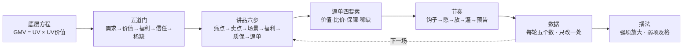

# 成交方程式-总览

> [!abstract] 一句话
> 一页看懂：直播只有两个字——拉新、逼单；七层体系从钱从哪来，一直讲到你是谁。 判断讲得对不对只有一个标准：[[讲到自己都想买]]。

| 层 | 解决什么 | 页面 | 课程 |
| --- | --- | --- | --- |
| 1 | 钱从哪来 | [[底层方程]] | [[第1课 底层方程]] |
| 2 | 她为什么买 | [[五道门]] | [[第2课 五道门]] |
| 3 | 一款怎么讲 | [[讲品六步]] | [[第3课 讲品六步]] |
| 4 | 怎么收口 | [[逼单四要素]] | [[第4课 逼单四要素]] |
| 5 | 一场怎么排 | [[憋单框架]] | [[第5课 节奏]] |
| 6 | 怎么越播越好 | [[每轮五个数]] | [[第6课 数据]] |
| 7 | 你是谁 | [[播法类型]] | [[第7课 你的播法]] |

贯穿模块：[[拆解七步]]（[[第8课 拆解顶尖直播间]]）· [[合规红线]]（[[第9课 合规红线与出师]]）

为什么这样教：[[失败1-试训半天流失]] · [[失败2-19场4场达标]] · [[失败3-打法卡8张未命中]]（[[第0课 为什么这样教]]）

给投资人：[[直播电商市场规模]] · [[主播供给与收入]] · [[一笔真实的账]] · [[经济价值推算]]

白板：`canvas/成交方程式-总览.canvas` · 数据库视图：`bases/场次数据.base`
