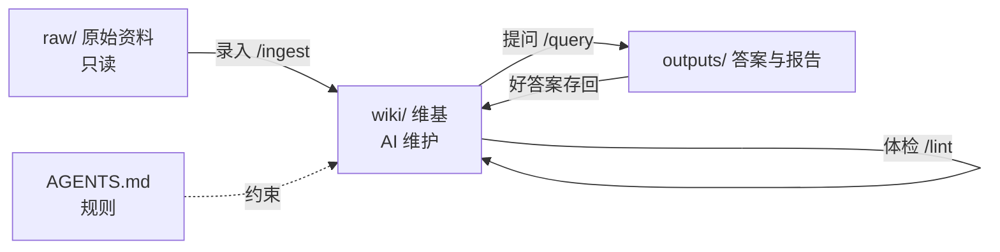

# 知识库使用说明

> [!abstract] 一句话
> 你只做三件事：**放资料、提问题、每周体检**。整理、链接、索引、日志全部交给 AI。

## 一张图看懂

## 三件事

| 你做什么 | 怎么做 | AI 做什么 |
| --- | --- | --- |
| 放资料 | 拖进 `raw/`，或用 [[Obsidian Web Clipper]] 一键剪藏 | 读全文、写 [[摘要-主播训练体系手册\|摘要页]]、更新概念页、记日志 |
| 提问题 | Claude Code 里输入 `/query 问题` | 读 [[index]] 找页面，带出处回答，好答案存回 |
| 每周体检 | 输入 `/lint` | 查冲突、断链、孤立页、缺口，写 [[体检报告-2026-09-26\|体检报告]] |

## 从哪里开始读

1. [[成交方程式-总览]] —— 七层体系一页看懂
2. [[第0课 为什么这样教]] —— 三次失败，三条理由
3. [[index]] —— 全部页面分类目录
4. [[log]] —— 这个库是怎么一步步长出来的

## 怎么看

- **关系图谱**：颜色 = 页面类型（白 综合 · 橙 课程 · 金 概念 · 紫 对比 · 蓝 实体 · 灰 摘要 · 红 问题）
- **白板**：`canvas/` —— 总览、五道门、训练路线图、知识库结构
- **数据库**：`bases/` —— 场次数据（带达成率公式）、打法卡（按命中分组）、人群、概念库（按被引用次数排序）

## 规矩

- `raw/` 只读；`wiki/` 交给 AI；改规则要记日志 → 详见 [[AGENTS]]
- 方法原理 → [[LLM Wiki方法]] · [[第二大脑三操作]]
- 换别的 AI 用 → 仓库 `README.md` 第九节
